[TOC]

# 0.minimvc项目说明

无须多说，学习流行框架的源代码是提升自己编程能力最好的方式。但直接跑出看框架的源代码，通常会很沮丧，可能是因为框架中为了解决某个你完全不知道的知识点，也可能是框架的代码写得太飘逸，当然也可能是框架的代码写错了等等原因。不管怎么样，通常很多人就会放弃框架源代码的阅读。我个人认为学习框架应该分为三部曲来做：

> 1. ***非常熟练***的使用框架
> 2. 写或者找出一个mini版本的框架模仿 版本，这样可以让你知道框架核心组件的结构与交互情况
> 3. 分功能的仔细研读框架源代码（尽可能从比较早期版本开始再到最新版本的顺序阅读）

此项目就是我说的三部曲的第二步。本项目主要是说明如何开发一个mvc框架，在这个项目里面模仿struts 2 与spring mvc开发了两个mini版本的mvc框架，主要的目的是：

1. 了解mvc框架的原理
2. 了解mvc框架是如何开发出来的
3. 为深入学习struts2 与spring mvc框架源代码打下好的基础

> checkout项目后，请留意不同tag下的代码

# 1. mvc架构模式

​	mvc框架是一种项目组件之间的组织结构以及交互关系的描述，是现今web开发中常见的架构模式 。但早起提出mvc架构时，并不是针对web开发而言的，而是针对桌面窗口应用程序而言，到后来演变到web开发上的。

## 1.1  通用的mvc架构模式

下图是通用的mvc的架构图形描述：

mvc1 :

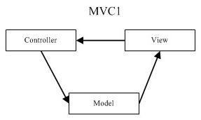

mvc2:

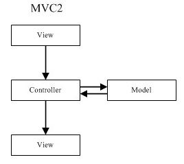

## 1.2 java web架构模式

mvc1 -1 :

JSP Model1是JavaWeb早期的模型，它适合小型Web项目，开发成本低！Model1第一代时期，服务器端只有JSP页面，所有的操作都在JSP页面中，连访问数据库的API也在JSP页面中完成。也就是说，所有的东西都耦合在一起，对后期的维护和扩展极为不利。

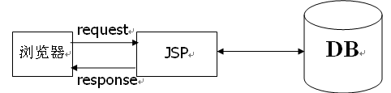

mvc1-2 :

JSP Model1第二代有所改进，把业务逻辑的内容放到了JavaBean中，而JSP页面负责显示以及请求调度的工作。虽然第二代比第一代好了些，但还让JSP做了过多的工作，JSP中把视图工作和请求调度（控制器）的工作耦合在一起了。

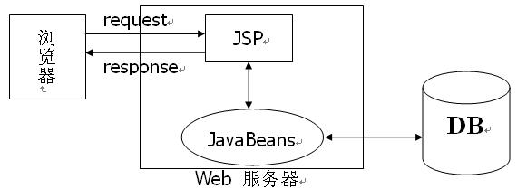

mvc2:

JSP Model2模式已经可以清晰的看到MVC完整的结构了。

- JSP：视图层，用来与用户打交道。负责接收用来的数据，以及显示数据给用户；
- Servlet：控制层，负责找到合适的模型对象来处理业务逻辑，转发到合适的视图；
- JavaBean：模型层，完成具体的业务工作，例如：开启、转账等。

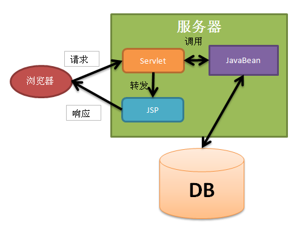

## 1.3 MVC与3层结构

所谓三层是表述层（WEB层）、业务逻辑层（Business Logic），以及数据访问层（Data Access）。

- WEB层：也称之为UI层，包含JSP和Servlet等与WEB相关的内容；
- 业务逻辑层：也称之为service层，业务层中不包含JavaWeb API，它只关心业务逻辑；
- 数据访问层：也称之为repository层，封装了对数据库的访问细节；

 三层之间的调用顺序是UI->Service->dao，三层之间如果要传递数据，一般还会创建一个实体层（entity，有时也命名为model层）。

MVC架构与3层结构的整合使用，主要是把mvc架构的java bean这个模型层，继续拆分为业务逻辑层与数据访问层。

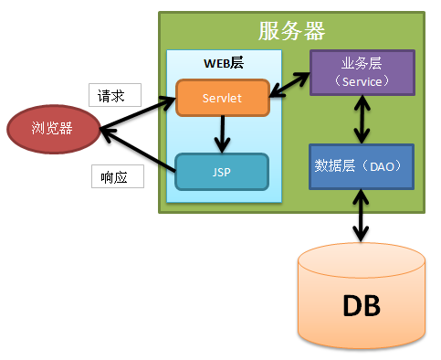

# 2. 开发mvc框架的流程

​	没有struts2，spring mvc之类的框架，我们利用java jsp,servlet,java bean也是可以开发mvc 项目的。

## 2.1 总控器(Dispatcher)

在没有MVC框架前，我们利用java web技术进行mvc形式的开发的大致架构如下：

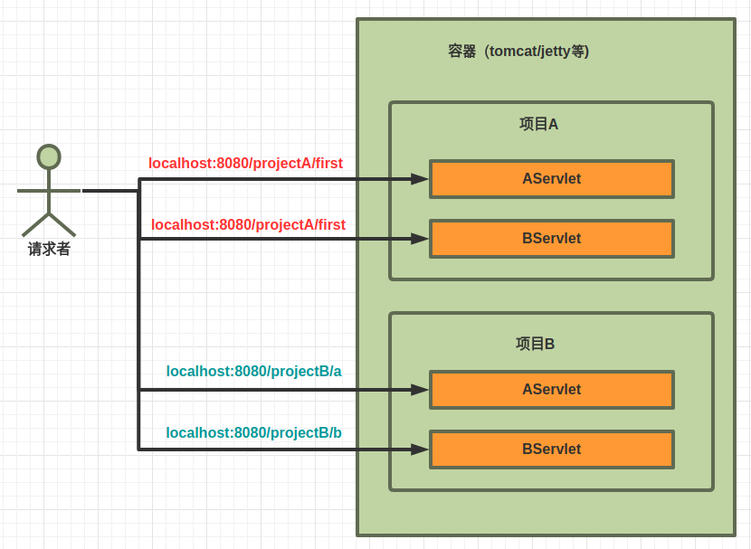

​	上面的架构由容器依据请求的URL来决定交给哪个项目的哪个Servlet处理请求（此时的Servlet是MVC架构中的控制器），如果针对所有的控制器有一些共同的、通用的操作就通过容器级别的组件来完成，比如Tomcat中可以通过Valve组件来实现。

​	如果我们要实现一些通用的功能，由于我们并不能改变容器代码，也不应该改变容器代码，所以我们的第一步是创建一个总控器，让所有的请求都经过这个总控器，由这个总控器再依据规定把请求交给不同的处理者（handler）去处理。

​	总控器相当于把分散化的请求处理（一个url，一个servlet）变得集中化，然后就可以依据自己的规则再分散化。

​	集中化带来的好处就是把一些针对处理者通用的功能，都可以交给总控器去统管执行。当然也会为 自己的MVC框架的扩展提供了更多的可能。***甚至整个替换掉自己的框架的组件***。集中化后的架构图如下：

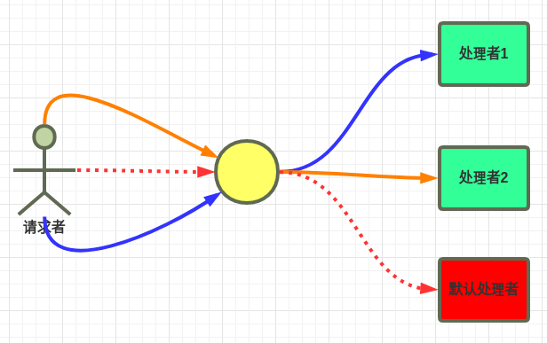

这个总控器有时也称之为调度器或者前端控制器（front controller）

## 2.2 控制器

控制器也称之为请求处理者，因为它是真正处理请求的，作为MVC框架的使用者来说，平时的工作就是：

- 编写控制器
- 注册控制器

而作为框架的实现者来说，对于控制器这块的工作就是：

- 记录注册的控制器
- 依据请求信息，找到合适的控制器
- 执行控制器

### 2.2.1 记录映射关系

​	在MVC框架中，所谓映射（Mapping）关系，指的就是请求URL与请求的处理者（Handler，Controller，也称之为后端控制器）之间的关系。一般来说，描述这种关系主要有以下几种方式达成

1. 命名习惯：无须任何配置，比如：url中有home，那么就是调用home控制器
2. 配置文件描述,比如Struts.xml中的Action元素配置
3. 代码描述
   1. 注解的形式描述，比如@RequestMapping
   2. 框架提供的API形式描述，比如类似这样的代码：Mappings.add("url",Handler.class)

关于这块的处理，MVC框架主要要实现的功能就是以下这么几块：

1. 读取描述信息
2. 处理描述信息
3. 存放处理后的描述信息
4. 缓存结果：因为描述信息基本是死的，有必要只处理一次，并缓存起来。

这些工作都是在请求没有真正进来时就可以完成的，当然这些工作，作为框架的开发人员也可以在每次请求进来时重复处理，如果你利用了缓存技术的话。

### 2.2.2 找出处理方法

​	真正的请求处理者，是Handler类中的方法，而不是Handler类本身。

​	在java语言中，函数并不是第一等的公民，也就是说函数并不能脱离类而独立存在。虽然从JDK 8开始，由于lambda表达式的出现，函数“勉强”可以称之为一等公民，但还没有真正从语言层面把函数实现为一等公民。

​	正是因为这个历史原因，给我们找出处理者带来了一定的困难，当然也带来了灵活性（对于框架使用者来说）。

​	为了找出这个方法从逻辑上讲有以下几种方法。

1. 实现一个接口
2. 命名习惯：比如URL为Home/Index，表示执行Home控制器的Index方法
3. 配置文件中配置，比如struts中的配置method
4. 方法上添加注解，比如spring mvc的RequestMapping
5. 专门的组件体系去处理，比如：Spring MVC中的HandlerAdapter以及ASP.NET MVC中的路由系统都有这方面的功能。

### 2.2.3 执行处理者

请求处理类的方法找到了，剩下的工作就是执行这个方法，从整体上来说，执行一个方法就是下面的几个事情

> 1. 实例化方法所在类的对象，可能牵涉到构造函数参数及字段数据的赋值处理
> 2. 是否缓存这个控制器实例，用一个实例处理多个请求还是每次都实例化实例处理请求。
> 3. Web开发中常用类型的封装处理，让框架使用人员感觉不到在进行web开发以及便于单元测试等
> 4. 准备方法的参数对象
> 5. 执行方法
> 6. 解析方法的结果并处理

## 2.3 数据绑定

数据处理主要是把Http请求中的字符串型数据赋值给某一个java类型。

HTTP请求数据主要来源于以下几个地方

>  	1. 查询字符串
>  	2. 表单数据
>  	3. cookie

数据处理主要的任务分为以下3个：	

> 1. 数据类型转换
> 2. 数据校验
> 3. 赋值
> 4. 错误处理（上面3种操作产生的错误）

数据绑定的处理的结构如下图：

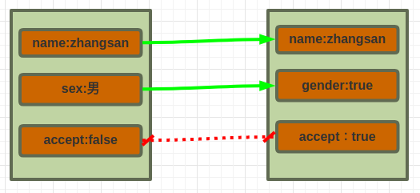

上边的图形中，左边是来源于HTTP请求的数据，右边是需要绑定的一个java类型中的字段情况。name是字符串类型，gender是boolean类型，accept也是boolean类型。一个好的模型处理，最好是能处理上面的数据绑定映射的问题

- 同名的映射，比如name
- 异名的映射，比如sex与gender
- 同类型的映射，比如name都是字符串
- 数据类型的转换，比如把男转换为true，女转换为false等
- 可以设定，哪些字段不需要绑定，比如上面的accept字段，即便HTTP请求中有accept的数据，也不绑定。当然，你想更灵活点，可以设置哪些字段参与绑定，哪些字段不参与绑定。
- 数据校验：字段基本的校验，比如name字段必须有数据，长度不超过20等。模型级别的校验，比如名字为“西施”，性别不能为男这种牵涉到多个字段的这种模型级别校验。

## 2.4 呈现视图

​	最终我们总是会响应一些数据给客户端的（主要是Browser），浏览器主要接收的数据有如下类型：

- 纯文本数据
- html数据
- json数据
- 二进制数据：如图片

​	也就是说jsp这种格式的文件，浏览器是识别不了的，必须经过转译、处理成浏览器能接受的格式后才能发送给浏览器。而jsp转译的处理，通常会比较复杂，mvc框架一般不处理这块，而是交给第三方的处理引擎去处理。我这里说的引擎主要指的是像jarkata这种jsp的解析器。

​	为了灵活，会创建出一个抽象：视图名，目的是为了与具体的视图文件以及视图引擎解耦。这样可以让自己的MVC框架可以支持多套视图引擎。

​	而按照MVC架构的理念，是由Controller来决定呈现哪个视图以及视图所用数据的。所以视图名应该由控制器处理方法决定，视图所需要的数据也要由Controller决定。决定视图的名字很简单，重点是如何把视图所需要的数据传递给视图引擎。

如果不牵涉到复杂的视图引擎处理，那么视图这块的处理架构图如下：

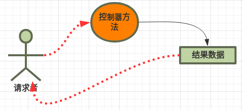

牵涉到视图引擎的整个视图处理的结构如下图：

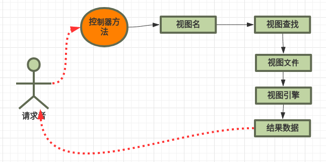

### 2.4.1 找出视图

​	找出视图主要指的是通过“视图名”找出真正的视图文件，这点与找出处理方法是类似的，这里不再赘述，比如SpringMVC中，就有通过命名习惯的方式找视图文件（控制器方法返回一个名字+前缀+后缀）。

### 2.4.2 传递数据给视图

​	一般是会把数据存放到request作用域、session作用域、application作用域里面，然后视图引擎去这些作用域里面读取。如果某些视图引擎不支持从这里读取数据，可能就需要写一个组件用来桥接作用域与视图引擎。

​	对于跨请求的数据，我们就不能放在request作用域了，可能会放置在session作用域，但对于一些临时跨请求的数据传递，可能在读取之后马上把session作用域中的数据删除掉，以减少session中数据节省内存。

### 2.4.3 呈现视图(Render View)

如果牵涉到视图引擎，MVC框架只需要把数据、请求对象与相应对象传输过去即可，剩下的交给引擎去做。如果不牵涉到视图引擎。视图呈现可以由框架本身来处理，比如构建一个视图呈现的子组件体系来处理。或者构建一个视图呈现的子组件系统，把两种处理方式都统一起来。

## 2.5 静态资源处理

​	一般来说，由于静态资源是浏览器可以识别的，不需要任何额外的处理，所以容器一般会直接实现对静态资源的处理。正是由于这种情况的存在，所以几乎所有的MVC框架都会对静态资源做一些额外的安排。

​	所以我们自己开发MVC框架时一般会把这块进行封装，以便你不需要对静态资源进行额外处理时，交给容器去处理，如果需要进行额外的处理（比如积分达到100分才能下载图片），就交给专门的控制器或Servlet或者Filter去处理。

# 3. mini mvc框架实现的说明

## 3.1 ministruts2

### 3.1.1 cj：项目简要说明

  目的：  此mini struts库，是对struts2 的一个极度简化
        仅仅只是做教学用途
   项目说明：
   ministrutslib，是一个库项目
   ministrutsweb是一个用来测试ministrutslib的web项目

### 3.1.2 整个流程如下：

####  StrutsPrepareAndExecuteFilter是一个Servlet过滤器

    init方法：读取classpath下的struts.xml文件
        得到所有的拦截器配置
        得到action访问后缀
        得到所有的Action配置信息
     doFilter方法：
        不以action结尾，继续正常的servlet流程
        得到本次请求的Action信息
        创建ActionInvocation（同时创建了ActionContext对象）。并调用invoke方法
        依据invoke方法返回的字符串值，进行简单的请求转发，并没有像struts2那样有一套Result的处理体系。
        从Threadlocal中移除ActionContext对象

#### ActionInvocation

    创建ActionInvocation实例
        解析出所有的拦截器
        调用拦截器的init方法
        创建Action类实例
     调用invoke方法：
        依次调用拦截器
        拦截器无返回值就调用Action类的方法。
        最终返回一个字符串

#### ActionContext

    创建ActionContext实例时：
        实例化一个Map<String,Object>的上下文对象（context）
        把request，response，session，application，parameters对象方法放到context中
        创建ValueStack对象
        把Action对象本身放入到ValueStack的栈顶
        把ValueStack对象通过request.setAttribute方法放入到请求作用域中
        最后把值栈对象放入到context对象中

#### ParametersInterceptor

    执行intercept方法时（此方法有参数类型为ActionInvocation）：
        利用ActionInvocation的getActionContext方法得到ActionContext对象
        利用ActionContext对象得到ValueStack对象
        利用ValueStack对象得到Action类的对象
        给Action对象通过BeanUtils.populate给Action的成员赋值

## 3.2 minispringmvc

# 参考资料

[java web  MVC](https://www.cnblogs.com/pwc1996/p/4839178.html)

[mvc架构模式](http://www.360doc.com/content/11/0830/14/7532286_144483363.shtml)

